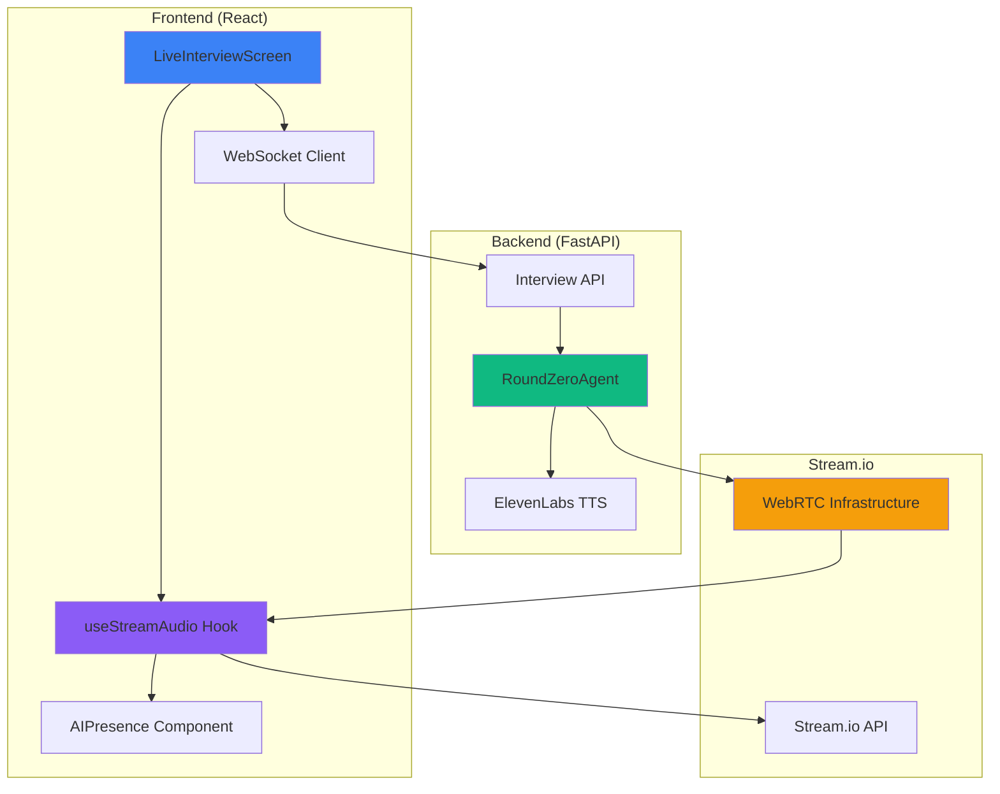
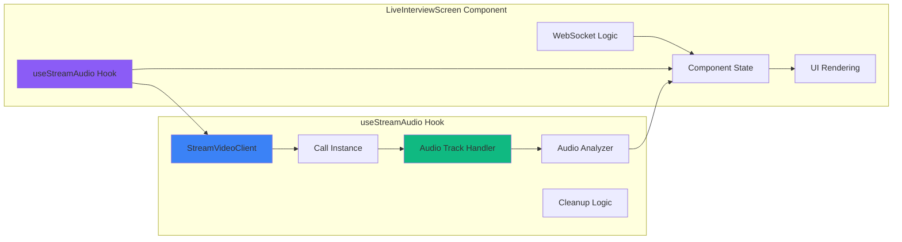
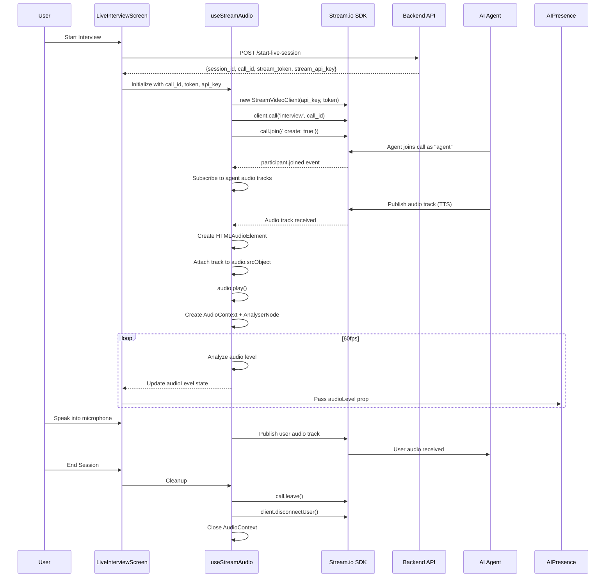

# Design Document: Frontend Stream.io Audio Integration

## Overview

This design implements complete Stream.io Video SDK integration in the React frontend to enable real-time bidirectional audio communication between users and the AI interviewer. The backend already generates audio using ElevenLabs TTS and publishes it to Stream.io WebRTC calls via the vision_agents framework. The frontend currently has placeholder TODO code and doesn't actually join the Stream.io call, causing users to disconnect immediately.

### Current State

**Backend (Working):**
- Uses vision_agents framework with `getstream.Edge()` to join Stream.io calls
- Agent joins with call_type "interview" and call_id format: "call_{session_id[:8]}"
- ElevenLabs TTS generates audio, agent publishes audio tracks to Stream.io
- Stream.io API key and secret configured in backend environment

**Frontend (Broken):**
- LiveInterviewScreen.tsx has placeholder TODO comments
- StreamVideoClient never initialized
- Call never joined
- Audio tracks never subscribed
- User disconnects immediately after session start

### Solution Approach

Implement full Stream.io SDK integration in LiveInterviewScreen component:
1. Initialize StreamVideoClient with API key and user token from backend
2. Join Stream.io call using call_id from backend response
3. Subscribe to audio tracks from "agent" participant
4. Enable user microphone and publish audio to call
5. Analyze audio levels using Web Audio API for visualization
6. Handle connection lifecycle, errors, and cleanup

### Key Design Decisions

**Decision 1: Use Stream.io for Audio, WebSocket for State**
- Stream.io handles all audio streaming (bidirectional WebRTC)
- WebSocket handles state updates (ai_state, confidence, metrics)
- Ignore WebSocket "ai_audio" messages (legacy, replaced by Stream.io)
- Rationale: Separation of concerns, leverage each system's strengths

**Decision 2: Custom Hook for Stream.io Logic**
- Create `useStreamAudio` hook to encapsulate Stream.io integration
- Keeps LiveInterviewScreen component clean and focused on UI
- Makes Stream.io logic reusable and testable
- Rationale: React best practices, separation of concerns

**Decision 3: Automatic Retry with Exponential Backoff**
- Retry call joining up to 3 times (1s, 2s, 4s delays)
- Automatic reconnection on connection drop
- Rationale: Handle transient network issues gracefully

**Decision 4: Web Audio API for Visualization**
- Use AudioContext and AnalyserNode for real-time audio level detection
- Sample at 60fps using requestAnimationFrame
- Pass normalized level (0-100) to AIPresence component
- Rationale: Provides visual feedback that audio is working

## Architecture

### System Context Diagram



### Component Architecture




### Data Flow Diagram



## Components and Interfaces

### 1. useStreamAudio Custom Hook

**Purpose:** Encapsulate all Stream.io SDK integration logic

**Interface:**
```typescript
interface UseStreamAudioOptions {
  callId: string;
  streamToken: string;
  streamApiKey: string;
  userId: string;
  onConnectionChange?: (status: ConnectionStatus) => void;
  onError?: (error: StreamError) => void;
}

interface UseStreamAudioReturn {
  audioLevel: number;              // 0-100
  connectionStatus: ConnectionStatus;
  error: StreamError | null;
  isAgentConnected: boolean;
  retryConnection: () => Promise<void>;
}

type ConnectionStatus = 
  | 'initializing' 
  | 'connecting' 
  | 'connected' 
  | 'disconnected' 
  | 'reconnecting' 
  | 'error';

interface StreamError {
  type: 'initialization' | 'join' | 'audio' | 'permission' | 'network';
  message: string;
  details?: any;
}

function useStreamAudio(options: UseStreamAudioOptions): UseStreamAudioReturn
```

**Responsibilities:**
- Initialize StreamVideoClient with API key and token
- Join Stream.io call with retry logic
- Subscribe to participant events and audio tracks
- Request microphone permission and publish user audio
- Analyze audio levels using Web Audio API
- Handle connection lifecycle and errors
- Cleanup resources on unmount

**State Management:**
```typescript
const [audioLevel, setAudioLevel] = useState(0);
const [connectionStatus, setConnectionStatus] = useState<ConnectionStatus>('initializing');
const [error, setError] = useState<StreamError | null>(null);
const [isAgentConnected, setIsAgentConnected] = useState(false);

const clientRef = useRef<StreamVideoClient | null>(null);
const callRef = useRef<Call | null>(null);
const audioContextRef = useRef<AudioContext | null>(null);
const analyserRef = useRef<AnalyserNode | null>(null);
const animationFrameRef = useRef<number | null>(null);
```


### 2. LiveInterviewScreen Component Updates

**Current Issues:**
- Placeholder TODO code for Stream SDK
- callId and streamToken retrieved but never used
- No actual Stream.io integration
- handleAIAudio() uses WebSocket audio (legacy approach)

**Required Changes:**
```typescript
// Add Stream.io state
const [streamApiKey, setStreamApiKey] = useState<string | null>(null);

// Use the custom hook
const {
  audioLevel,
  connectionStatus,
  error: streamError,
  isAgentConnected,
  retryConnection
} = useStreamAudio({
  callId: callId || '',
  streamToken: streamToken || '',
  streamApiKey: streamApiKey || '',
  userId: userId, // from auth context
  onConnectionChange: (status) => {
    console.log('Stream connection status:', status);
  },
  onError: (error) => {
    console.error('Stream error:', error);
    setError(error.message);
  }
});

// Update initializeSession to get stream_api_key
const response = await axios.post('/api/interview/start-live-session', ...);
const { session_id, call_id, stream_token, stream_api_key } = response.data;
setStreamApiKey(stream_api_key);

// Remove handleAIAudio() - audio now comes from Stream.io
// Update handleWebSocketMessage to ignore 'ai_audio' messages
case 'ai_audio':
  // Ignore - audio now comes from Stream.io WebRTC
  console.log('Ignoring WebSocket ai_audio (using Stream.io)');
  break;

// Pass audioLevel to AIPresence
<AIPresence
  aiState={sessionState?.ai_state || 'idle'}
  audioLevel={audioLevel}
  isConnected={connectionStatus === 'connected'}
/>

// Display connection status
{connectionStatus !== 'connected' && (
  <div className="connection-status">
    {connectionStatus === 'connecting' && 'Connecting to audio...'}
    {connectionStatus === 'reconnecting' && 'Reconnecting...'}
    {connectionStatus === 'error' && 'Audio connection failed'}
  </div>
)}
```

### 3. AIPresence Component (No Changes Required)

**Current Interface:**
```typescript
interface AIPresenceProps {
  aiState: 'idle' | 'listening' | 'thinking' | 'speaking';
  audioLevel?: number;  // 0-100
  isConnected: boolean;
}
```

**Behavior:**
- Already accepts audioLevel prop
- Visualizes audio with waveforms when aiState === 'speaking'
- Shows connection status
- No changes needed - just pass correct audioLevel from useStreamAudio

### 4. AIAudioPlayer Component (Deprecated)

**Current Purpose:** Play audio from MediaStreamTrack

**Decision:** Keep component but don't use it for Stream.io audio
- Stream.io audio is played directly via HTMLAudioElement in useStreamAudio hook
- AIAudioPlayer was designed for WebSocket-based audio (legacy)
- May be useful for future features (e.g., playback of recorded audio)
- No changes required

## Data Models

### Stream.io Configuration

```typescript
interface StreamConfig {
  apiKey: string;        // From backend response
  token: string;         // JWT token for user authentication
  callId: string;        // Format: "call_{session_id[:8]}"
  callType: string;      // Always "interview"
  userId: string;        // From auth context
}
```

### Audio Track State

```typescript
interface AudioTrackState {
  track: MediaStreamTrack;
  participantId: string;
  isPlaying: boolean;
  audioElement: HTMLAudioElement;
  stream: MediaStream;
}
```

### Connection State

```typescript
interface ConnectionState {
  status: ConnectionStatus;
  retryCount: number;
  lastError: StreamError | null;
  connectedAt: Date | null;
  agentJoinedAt: Date | null;
}
```

### Audio Analysis State

```typescript
interface AudioAnalysisState {
  audioContext: AudioContext;
  analyser: AnalyserNode;
  dataArray: Uint8Array;
  currentLevel: number;  // 0-100
  isSpeaking: boolean;   // level > 10
}
```


## Correctness Properties

*A property is a characteristic or behavior that should hold true across all valid executions of a system—essentially, a formal statement about what the system should do. Properties serve as the bridge between human-readable specifications and machine-verifiable correctness guarantees.*

### Property Reflection

Before defining properties, I analyzed the acceptance criteria to eliminate redundancy:

**Redundancies Identified:**
1. Properties 1.2 and 1.3 (client initialization with credentials) can be combined into one comprehensive property about initialization with valid credentials
2. Properties 3.4 and 3.6 (creating audio element and attaching track) can be combined into one property about audio element setup
3. Properties 6.1, 6.2, and 6.3 (audio analysis setup) can be combined into one property about Web Audio API initialization
4. Properties 8.2, 8.3, 8.4, and 8.5 (cleanup actions) can be combined into one comprehensive cleanup property

**Properties Retained:**
- Each property provides unique validation value
- Properties test different aspects: initialization, connection, audio handling, error handling, cleanup
- No logical redundancy where one property implies another

### Property 1: Client Initialization with Valid Credentials

*For any* valid API key, user token, and user ID, initializing a StreamVideoClient should succeed and store the client instance in a ref without re-creating it on subsequent renders.

**Validates: Requirements 1.2, 1.3, 1.5**

### Property 2: Call Creation and Joining

*For any* valid call_id, creating a call reference with type "interview" and joining with audio enabled should result in a successful connection.

**Validates: Requirements 2.1, 2.2, 2.3, 2.4**

### Property 3: Participant Event Subscription

*For any* successful call join, the system should subscribe to participant events and detect when the "agent" participant joins.

**Validates: Requirements 3.1, 3.2**

### Property 4: Audio Track Filtering and Setup

*For any* set of media tracks from the agent participant, filtering for audio tracks (kind === "audio") and setting up an HTMLAudioElement with the track's MediaStream should enable audio playback.

**Validates: Requirements 3.3, 3.4, 3.6**

### Property 5: Microphone Permission and Publishing

*For any* granted microphone permission, the system should enable the microphone and publish the user's audio track to the Stream.io call.

**Validates: Requirements 4.1, 4.5**

### Property 6: Web Audio API Analysis

*For any* playing audio track, creating an AudioContext with AnalyserNode and sampling at 60fps should produce audio level values in the range 0-100.

**Validates: Requirements 6.1, 6.2, 6.3, 6.4**

### Property 7: Audio Level State Transition

*For any* audio level value, when the level exceeds 10, the ai_state should transition to "speaking".

**Validates: Requirements 6.6**

### Property 8: Automatic Reconnection on Connection Drop

*For any* WebRTC connection drop, the system should attempt automatic reconnection.

**Validates: Requirements 7.5**

### Property 9: Error Logging

*For any* error that occurs during Stream.io operations, the system should log detailed error information to the console.

**Validates: Requirements 7.6**

### Property 10: Comprehensive Cleanup

*For any* component unmount or session end, the system should call leave() on the Stream call, disconnect the StreamVideoClient, stop all audio tracks, close the AudioContext, and remove all event listeners.

**Validates: Requirements 8.1, 8.2, 8.3, 8.4, 8.5**

### Property 11: Independent Connection Handling

*For any* WebSocket or Stream.io connection failure, the other connection should continue operating independently.

**Validates: Requirements 9.5**

### Property 12: WebSocket Message Routing

*For any* "state_change" WebSocket message, the UI state should update, and for any "ai_audio" message, it should be ignored.

**Validates: Requirements 9.2, 9.3**

### Property 13: Audio Track Validation

*For any* received audio track, the system should verify the track is not muted and has readyState "live" before attempting playback.

**Validates: Requirements 10.1, 10.2**

### Property 14: Most Recent Track Playback

*For any* set of multiple audio tracks from the agent, the system should play only the most recent track.

**Validates: Requirements 10.4**


## Error Handling

### Error Categories

**1. Initialization Errors**
- StreamVideoClient creation fails
- Invalid API key or token
- Network unavailable

**Handling:**
```typescript
try {
  const client = new StreamVideoClient({ apiKey, token, user: { id: userId } });
  clientRef.current = client;
  setConnectionStatus('connecting');
} catch (error) {
  console.error('StreamVideoClient initialization failed:', error);
  setError({
    type: 'initialization',
    message: 'Failed to initialize audio system',
    details: error
  });
  setConnectionStatus('error');
}
```

**2. Call Join Errors**
- Call doesn't exist
- Network timeout
- Permission denied

**Handling:**
```typescript
const joinWithRetry = async (retryCount = 0): Promise<void> => {
  try {
    await call.join({ create: true });
    setConnectionStatus('connected');
    setError(null);
  } catch (error) {
    if (retryCount < 3) {
      const delay = Math.pow(2, retryCount) * 1000; // 1s, 2s, 4s
      console.log(`Join failed, retrying in ${delay}ms (attempt ${retryCount + 1}/3)`);
      await new Promise(resolve => setTimeout(resolve, delay));
      return joinWithRetry(retryCount + 1);
    } else {
      console.error('Call join failed after 3 retries:', error);
      setError({
        type: 'join',
        message: 'Unable to join audio call - please refresh',
        details: error
      });
      setConnectionStatus('error');
    }
  }
};
```

**3. Microphone Permission Errors**
- User denies permission
- No microphone available
- Microphone in use by another app

**Handling:**
```typescript
try {
  await call.microphone.enable();
  console.log('Microphone enabled successfully');
} catch (error) {
  console.error('Microphone permission denied:', error);
  setError({
    type: 'permission',
    message: 'Microphone access required for interview',
    details: error
  });
  // Don't set connectionStatus to 'error' - audio reception still works
}
```

**4. Audio Track Errors**
- No audio tracks received within timeout
- Audio track ends unexpectedly
- Audio playback fails

**Handling:**
```typescript
// Timeout for audio tracks
const audioTimeout = setTimeout(() => {
  if (!isAgentConnected) {
    console.warn('No audio tracks received within 10 seconds');
    setError({
      type: 'audio',
      message: 'Waiting for AI audio...',
      details: 'Agent has not published audio tracks yet'
    });
  }
}, 10000);

// Track ended unexpectedly
audioElement.onended = () => {
  console.warn('Audio track ended unexpectedly');
  // Wait for next track - don't treat as error
};

// Playback failed
try {
  await audioElement.play();
} catch (error) {
  console.error('Audio playback failed:', error);
  // Retry on user interaction
  document.addEventListener('click', () => audioElement.play(), { once: true });
}
```

**5. Connection Drop Errors**
- Network disconnection
- WebRTC connection lost
- Stream.io service unavailable

**Handling:**
```typescript
call.on('connection.changed', (event) => {
  if (event.connectionState === 'disconnected') {
    console.warn('Connection lost, attempting reconnection');
    setConnectionStatus('reconnecting');
    attemptReconnection();
  }
});

const attemptReconnection = async () => {
  try {
    await call.reconnect();
    setConnectionStatus('connected');
    setError(null);
  } catch (error) {
    console.error('Reconnection failed:', error);
    setError({
      type: 'network',
      message: 'Connection lost - reconnecting...',
      details: error
    });
  }
};
```

**6. Cleanup Errors**
- Leave call fails
- Disconnect fails
- Resource cleanup fails

**Handling:**
```typescript
const cleanup = async () => {
  try {
    // Stop audio analysis
    if (animationFrameRef.current) {
      cancelAnimationFrame(animationFrameRef.current);
    }
    
    // Close audio context
    if (audioContextRef.current) {
      await audioContextRef.current.close();
    }
    
    // Leave call
    if (callRef.current) {
      await callRef.current.leave();
    }
    
    // Disconnect client
    if (clientRef.current) {
      await clientRef.current.disconnectUser();
    }
  } catch (error) {
    // Log but don't throw - allow unmount to proceed
    console.error('Cleanup error (non-fatal):', error);
  }
};
```

### Error Display Strategy

**User-Facing Messages:**
- Initialization: "Failed to initialize audio system"
- Join: "Unable to join audio call - please refresh"
- Permission: "Microphone access required for interview"
- Audio: "Waiting for AI audio..."
- Network: "Connection lost - reconnecting..."

**Color Coding:**
- Blue: Connecting/initializing
- Green: Connected/success
- Yellow: Warning (e.g., waiting for audio)
- Red: Error (requires user action)

**Error Recovery Actions:**
- Automatic retry for transient errors (network, join)
- User prompt for permission errors
- Refresh suggestion for fatal errors
- Graceful degradation (audio reception works without microphone)


## Testing Strategy

### Dual Testing Approach

This feature requires both unit tests and property-based tests for comprehensive coverage:

**Unit Tests:** Verify specific examples, edge cases, and error conditions
**Property Tests:** Verify universal properties across all inputs

Together, they provide comprehensive coverage where unit tests catch concrete bugs and property tests verify general correctness.

### Unit Testing

**Framework:** Vitest + React Testing Library

**Test Files:**
- `useStreamAudio.test.tsx` - Hook logic tests
- `LiveInterviewScreen.test.tsx` - Component integration tests

**Unit Test Cases:**

1. **Initialization Tests**
   - Component mounts and retrieves Stream API key from backend
   - StreamVideoClient initializes with correct credentials
   - Client instance stored in ref (same instance across renders)
   - Initialization failure displays error message

2. **Call Joining Tests**
   - Call created with type "interview" and correct call_id
   - Join method called with audio enabled
   - Retry logic: 3 attempts with 1s, 2s, 4s delays
   - All retries fail → error message displayed

3. **Audio Track Tests**
   - Agent participant joins → audio tracks retrieved
   - Audio tracks filtered by kind === "audio"
   - HTMLAudioElement created with autoplay=true
   - Track attached to audio.srcObject

4. **Microphone Tests**
   - Microphone permission requested on join
   - Permission granted → success indicator shown
   - Permission denied → warning message shown
   - User audio track published after permission grant

5. **Connection Status Tests**
   - Initializing → "Connecting to audio..."
   - Connected → "Audio connected"
   - Agent joined → "AI audio active"
   - Connection lost → "Connection lost - reconnecting..."
   - Color coding: blue, green, red

6. **Error Handling Tests**
   - Initialization fails → specific error message
   - Join fails → specific error message
   - Permission denied → specific error message
   - No audio within 10s → warning message
   - All errors logged to console

7. **Cleanup Tests**
   - End session → call.leave() called
   - Unmount → client.disconnectUser() called
   - Audio tracks stopped before disconnect
   - AudioContext closed
   - Event listeners removed
   - Cleanup failure → error logged but unmount proceeds

8. **WebSocket Integration Tests**
   - "ai_audio" message → ignored
   - "state_change" message → UI updated
   - WebSocket failure → Stream.io continues
   - Stream.io failure → WebSocket continues

**Mocking Strategy:**
```typescript
// Mock Stream.io SDK
vi.mock('@stream-io/video-react-sdk', () => ({
  StreamVideoClient: vi.fn().mockImplementation(() => ({
    call: vi.fn().mockReturnValue({
      join: vi.fn().mockResolvedValue({}),
      leave: vi.fn().mockResolvedValue({}),
      microphone: {
        enable: vi.fn().mockResolvedValue({})
      },
      on: vi.fn()
    }),
    disconnectUser: vi.fn().mockResolvedValue({})
  }))
}));

// Mock Web Audio API
global.AudioContext = vi.fn().mockImplementation(() => ({
  createAnalyser: vi.fn().mockReturnValue({
    fftSize: 256,
    frequencyBinCount: 128,
    getByteFrequencyData: vi.fn()
  }),
  createMediaStreamSource: vi.fn().mockReturnValue({
    connect: vi.fn()
  }),
  close: vi.fn().mockResolvedValue({})
}));
```

### Property-Based Testing

**Framework:** fast-check (JavaScript property-based testing library)

**Configuration:** Minimum 100 iterations per property test

**Property Test Cases:**

1. **Property 1: Client Initialization**
   ```typescript
   // Feature: frontend-stream-audio-integration, Property 1
   fc.assert(
     fc.property(
       fc.string(), // apiKey
       fc.string(), // token
       fc.string(), // userId
       (apiKey, token, userId) => {
         // Given valid credentials
         fc.pre(apiKey.length > 0 && token.length > 0 && userId.length > 0);
         
         // When initializing client
         const client = new StreamVideoClient({ apiKey, token, user: { id: userId } });
         
         // Then client should be created and stored in ref
         expect(client).toBeDefined();
         expect(clientRef.current).toBe(client);
         
         // And re-render should not create new instance
         const sameClient = clientRef.current;
         expect(sameClient).toBe(client);
       }
     ),
     { numRuns: 100 }
   );
   ```

2. **Property 2: Audio Track Filtering**
   ```typescript
   // Feature: frontend-stream-audio-integration, Property 4
   fc.assert(
     fc.property(
       fc.array(fc.record({
         kind: fc.constantFrom('audio', 'video'),
         id: fc.string()
       })),
       (tracks) => {
         // When filtering tracks
         const audioTracks = tracks.filter(t => t.kind === 'audio');
         
         // Then all returned tracks should be audio
         expect(audioTracks.every(t => t.kind === 'audio')).toBe(true);
         
         // And count should match audio tracks in input
         const expectedCount = tracks.filter(t => t.kind === 'audio').length;
         expect(audioTracks.length).toBe(expectedCount);
       }
     ),
     { numRuns: 100 }
   );
   ```

3. **Property 3: Audio Level Range**
   ```typescript
   // Feature: frontend-stream-audio-integration, Property 6
   fc.assert(
     fc.property(
       fc.array(fc.integer({ min: 0, max: 255 }), { minLength: 128, maxLength: 128 }),
       (frequencyData) => {
         // When analyzing audio level
         const average = frequencyData.reduce((sum, val) => sum + val, 0) / frequencyData.length;
         const normalizedLevel = (average / 255) * 100;
         
         // Then level should be in range 0-100
         expect(normalizedLevel).toBeGreaterThanOrEqual(0);
         expect(normalizedLevel).toBeLessThanOrEqual(100);
       }
     ),
     { numRuns: 100 }
   );
   ```

4. **Property 4: State Transition on Audio Level**
   ```typescript
   // Feature: frontend-stream-audio-integration, Property 7
   fc.assert(
     fc.property(
       fc.float({ min: 0, max: 100 }),
       (audioLevel) => {
         // When audio level changes
         const shouldBeSpeaking = audioLevel > 10;
         
         // Then ai_state should match expectation
         const aiState = shouldBeSpeaking ? 'speaking' : 'listening';
         expect(aiState === 'speaking').toBe(audioLevel > 10);
       }
     ),
     { numRuns: 100 }
   );
   ```

5. **Property 5: Most Recent Track Selection**
   ```typescript
   // Feature: frontend-stream-audio-integration, Property 14
   fc.assert(
     fc.property(
       fc.array(fc.record({
         id: fc.string(),
         timestamp: fc.integer({ min: 0, max: 1000000 })
       }), { minLength: 1 }),
       (tracks) => {
         // When selecting most recent track
         const mostRecent = tracks.reduce((latest, current) => 
           current.timestamp > latest.timestamp ? current : latest
         );
         
         // Then selected track should have highest timestamp
         expect(tracks.every(t => t.timestamp <= mostRecent.timestamp)).toBe(true);
       }
     ),
     { numRuns: 100 }
   );
   ```

### Integration Testing

**End-to-End Flow Test:**
```typescript
describe('Stream.io Audio Integration E2E', () => {
  it('should complete full audio flow from initialization to cleanup', async () => {
    // 1. Mount component
    const { getByText } = render(<LiveInterviewScreen {...props} />);
    
    // 2. Verify initialization
    await waitFor(() => {
      expect(getByText('Connecting to audio...')).toBeInTheDocument();
    });
    
    // 3. Simulate successful connection
    await waitFor(() => {
      expect(getByText('Audio connected')).toBeInTheDocument();
    });
    
    // 4. Simulate agent joining
    await waitFor(() => {
      expect(getByText('AI audio active')).toBeInTheDocument();
    });
    
    // 5. Verify audio level updates
    await waitFor(() => {
      expect(audioLevel).toBeGreaterThan(0);
    });
    
    // 6. End session
    fireEvent.click(getByText('End Session'));
    
    // 7. Verify cleanup
    await waitFor(() => {
      expect(mockCall.leave).toHaveBeenCalled();
      expect(mockClient.disconnectUser).toHaveBeenCalled();
    });
  });
});
```

### Test Coverage Goals

- Line coverage: >80%
- Branch coverage: >75%
- Function coverage: >85%
- Property tests: 100 iterations minimum
- All error paths tested
- All cleanup paths tested


## Implementation Guide

### Phase 1: Create useStreamAudio Hook

**File:** `frontend/src/hooks/useStreamAudio.ts`

**Implementation Steps:**

1. **Setup State and Refs**
```typescript
const [audioLevel, setAudioLevel] = useState(0);
const [connectionStatus, setConnectionStatus] = useState<ConnectionStatus>('initializing');
const [error, setError] = useState<StreamError | null>(null);
const [isAgentConnected, setIsAgentConnected] = useState(false);

const clientRef = useRef<StreamVideoClient | null>(null);
const callRef = useRef<Call | null>(null);
const audioContextRef = useRef<AudioContext | null>(null);
const analyserRef = useRef<AnalyserNode | null>(null);
const animationFrameRef = useRef<number | null>(null);
const audioElementRef = useRef<HTMLAudioElement | null>(null);
```

2. **Initialize StreamVideoClient**
```typescript
useEffect(() => {
  if (!streamApiKey || !streamToken || !userId) return;
  
  const initializeClient = async () => {
    try {
      const client = new StreamVideoClient({
        apiKey: streamApiKey,
        token: streamToken,
        user: { id: userId }
      });
      
      clientRef.current = client;
      setConnectionStatus('connecting');
      
      // Create and join call
      await joinCall(client);
    } catch (error) {
      handleError('initialization', 'Failed to initialize audio system', error);
    }
  };
  
  initializeClient();
  
  return () => {
    cleanup();
  };
}, [streamApiKey, streamToken, userId, callId]);
```

3. **Join Call with Retry**
```typescript
const joinCall = async (client: StreamVideoClient, retryCount = 0) => {
  try {
    const call = client.call('interview', callId);
    callRef.current = call;
    
    await call.join({ create: true });
    
    setConnectionStatus('connected');
    setError(null);
    
    // Setup event listeners
    setupEventListeners(call);
    
    // Enable microphone
    await enableMicrophone(call);
    
  } catch (error) {
    if (retryCount < 3) {
      const delay = Math.pow(2, retryCount) * 1000;
      console.log(`Join failed, retrying in ${delay}ms (attempt ${retryCount + 1}/3)`);
      await new Promise(resolve => setTimeout(resolve, delay));
      return joinCall(client, retryCount + 1);
    } else {
      handleError('join', 'Unable to join audio call - please refresh', error);
    }
  }
};
```

4. **Setup Event Listeners**
```typescript
const setupEventListeners = (call: Call) => {
  // Listen for participant joined
  call.on('participant.joined', (event) => {
    if (event.participant.userId === 'agent') {
      console.log('Agent joined the call');
      setIsAgentConnected(true);
      subscribeToAgentAudio(event.participant);
    }
  });
  
  // Listen for connection changes
  call.on('connection.changed', (event) => {
    if (event.connectionState === 'disconnected') {
      setConnectionStatus('reconnecting');
      attemptReconnection();
    }
  });
};
```

5. **Subscribe to Agent Audio**
```typescript
const subscribeToAgentAudio = (participant: Participant) => {
  // Get audio tracks
  const audioTracks = participant.publishedTracks.filter(
    track => track.kind === 'audio'
  );
  
  if (audioTracks.length === 0) {
    console.warn('No audio tracks from agent');
    setTimeout(() => subscribeToAgentAudio(participant), 1000);
    return;
  }
  
  // Use most recent track
  const audioTrack = audioTracks[audioTracks.length - 1];
  
  // Verify track is valid
  if (audioTrack.muted || audioTrack.readyState !== 'live') {
    console.warn('Audio track not ready:', { 
      muted: audioTrack.muted, 
      readyState: audioTrack.readyState 
    });
    return;
  }
  
  // Create audio element
  const audioElement = new Audio();
  audioElement.autoplay = true;
  audioElement.srcObject = new MediaStream([audioTrack]);
  audioElementRef.current = audioElement;
  
  // Play audio
  audioElement.play().catch(error => {
    console.error('Audio playback failed:', error);
    // Retry on user interaction
    document.addEventListener('click', () => audioElement.play(), { once: true });
  });
  
  // Setup audio analysis
  setupAudioAnalysis(audioTrack);
};
```

6. **Setup Audio Analysis**
```typescript
const setupAudioAnalysis = (audioTrack: MediaStreamTrack) => {
  try {
    const audioContext = new AudioContext();
    const analyser = audioContext.createAnalyser();
    analyser.fftSize = 256;
    
    const stream = new MediaStream([audioTrack]);
    const source = audioContext.createMediaStreamSource(stream);
    source.connect(analyser);
    
    audioContextRef.current = audioContext;
    analyserRef.current = analyser;
    
    // Start analyzing
    analyzeAudioLevel();
  } catch (error) {
    console.error('Audio analysis setup failed:', error);
  }
};
```

7. **Analyze Audio Level**
```typescript
const analyzeAudioLevel = () => {
  if (!analyserRef.current) return;
  
  const dataArray = new Uint8Array(analyserRef.current.frequencyBinCount);
  analyserRef.current.getByteFrequencyData(dataArray);
  
  // Calculate average level
  const average = dataArray.reduce((sum, value) => sum + value, 0) / dataArray.length;
  const normalizedLevel = (average / 255) * 100;
  
  setAudioLevel(normalizedLevel);
  
  // Continue analyzing at 60fps
  animationFrameRef.current = requestAnimationFrame(analyzeAudioLevel);
};
```

8. **Enable Microphone**
```typescript
const enableMicrophone = async (call: Call) => {
  try {
    await call.microphone.enable();
    console.log('Microphone enabled successfully');
  } catch (error) {
    handleError('permission', 'Microphone access required for interview', error);
  }
};
```

9. **Cleanup**
```typescript
const cleanup = async () => {
  try {
    // Stop audio analysis
    if (animationFrameRef.current) {
      cancelAnimationFrame(animationFrameRef.current);
      animationFrameRef.current = null;
    }
    
    // Close audio context
    if (audioContextRef.current) {
      await audioContextRef.current.close();
      audioContextRef.current = null;
    }
    
    // Stop audio element
    if (audioElementRef.current) {
      audioElementRef.current.pause();
      audioElementRef.current.srcObject = null;
      audioElementRef.current = null;
    }
    
    // Leave call
    if (callRef.current) {
      await callRef.current.leave();
      callRef.current = null;
    }
    
    // Disconnect client
    if (clientRef.current) {
      await clientRef.current.disconnectUser();
      clientRef.current = null;
    }
  } catch (error) {
    console.error('Cleanup error (non-fatal):', error);
  }
};
```

### Phase 2: Update LiveInterviewScreen Component

**File:** `frontend/src/components/LiveInterviewScreen.tsx`

**Implementation Steps:**

1. **Add Stream API Key State**
```typescript
const [streamApiKey, setStreamApiKey] = useState<string | null>(null);
```

2. **Update initializeSession**
```typescript
const response = await axios.post('/api/interview/start-live-session', {
  role,
  topics,
  difficulty,
  mode
}, {
  headers: {
    'Authorization': `Bearer ${localStorage.getItem('token')}`
  }
});

const { session_id, call_id, stream_token, stream_api_key } = response.data;

setSessionId(session_id);
setCallId(call_id);
setStreamToken(stream_token);
setStreamApiKey(stream_api_key); // NEW
```

3. **Use useStreamAudio Hook**
```typescript
const {
  audioLevel,
  connectionStatus,
  error: streamError,
  isAgentConnected
} = useStreamAudio({
  callId: callId || '',
  streamToken: streamToken || '',
  streamApiKey: streamApiKey || '',
  userId: userId, // from auth context
  onConnectionChange: (status) => {
    console.log('Stream connection status:', status);
  },
  onError: (error) => {
    console.error('Stream error:', error);
    setError(error.message);
  }
});
```

4. **Remove Legacy Code**
```typescript
// DELETE: initializeStreamSDK function (replaced by useStreamAudio)
// DELETE: handleAIAudio function (audio comes from Stream.io)
// DELETE: base64ToBlob function (no longer needed)
```

5. **Update WebSocket Handler**
```typescript
const handleWebSocketMessage = (data: any) => {
  switch (data.type) {
    case 'state_change':
      setSessionState(data.state);
      break;
    case 'ai_audio':
      // Ignore - audio now comes from Stream.io WebRTC
      console.log('Ignoring WebSocket ai_audio (using Stream.io)');
      break;
    // ... other cases
  }
};
```

6. **Update AIPresence Component Usage**
```typescript
<AIPresence
  aiState={sessionState?.ai_state || 'idle'}
  audioLevel={audioLevel}
  isConnected={connectionStatus === 'connected'}
/>
```

7. **Add Connection Status Display**
```typescript
{connectionStatus !== 'connected' && (
  <div className={`connection-status status-${connectionStatus}`}>
    {connectionStatus === 'initializing' && '🔄 Initializing audio...'}
    {connectionStatus === 'connecting' && '🔄 Connecting to audio...'}
    {connectionStatus === 'reconnecting' && '🔄 Reconnecting...'}
    {connectionStatus === 'error' && '❌ Audio connection failed'}
  </div>
)}

{isAgentConnected && (
  <div className="agent-status">
    ✅ AI audio active
  </div>
)}
```

8. **Update Cleanup**
```typescript
const cleanup = () => {
  // Close WebSocket
  if (wsRef.current) {
    wsRef.current.close();
    wsRef.current = null;
  }
  
  // Stream.io cleanup handled by useStreamAudio hook
};
```

### Phase 3: Update Backend API Response

**File:** `backend/routes/vision_interview.py`

**Required Change:**
```python
# Add stream_api_key to response
return StartLiveSessionResponse(
    session_id=session_id,
    call_id=call_id,
    stream_token=stream_token,
    stream_api_key=os.getenv("STREAM_API_KEY"),  # NEW
    status="initialized",
    question_count=5
)
```

**Update Response Model:**
```python
class StartLiveSessionResponse(BaseModel):
    session_id: str
    call_id: str
    stream_token: str
    stream_api_key: str  # NEW
    status: str
    question_count: int
```

### Phase 4: Add Styling

**File:** `frontend/src/components/LiveInterviewScreen.css` (create if needed)

```css
.connection-status {
  position: fixed;
  top: 20px;
  right: 20px;
  padding: 12px 20px;
  border-radius: 8px;
  font-size: 14px;
  font-weight: 500;
  z-index: 1000;
  animation: slideIn 0.3s ease-out;
}

.status-initializing,
.status-connecting {
  background: rgba(59, 130, 246, 0.9);
  color: white;
}

.status-connected {
  background: rgba(16, 185, 129, 0.9);
  color: white;
}

.status-reconnecting {
  background: rgba(251, 191, 36, 0.9);
  color: white;
}

.status-error {
  background: rgba(239, 68, 68, 0.9);
  color: white;
}

.agent-status {
  position: fixed;
  top: 70px;
  right: 20px;
  padding: 8px 16px;
  border-radius: 6px;
  font-size: 12px;
  background: rgba(16, 185, 129, 0.9);
  color: white;
  animation: slideIn 0.3s ease-out;
}

@keyframes slideIn {
  from {
    transform: translateX(100%);
    opacity: 0;
  }
  to {
    transform: translateX(0);
    opacity: 1;
  }
}
```

### Phase 5: Testing

1. **Create test file:** `frontend/src/hooks/useStreamAudio.test.ts`
2. **Create test file:** `frontend/src/components/LiveInterviewScreen.test.tsx`
3. **Run tests:** `npm test -- --run`
4. **Verify coverage:** `npm test -- --coverage`

### Phase 6: Manual Testing Checklist

- [ ] Start interview session
- [ ] Verify "Connecting to audio..." appears
- [ ] Verify "Audio connected" appears after connection
- [ ] Verify "AI audio active" appears when agent joins
- [ ] Verify audio plays from speakers
- [ ] Verify AIPresence waveforms animate with audio
- [ ] Verify microphone permission requested
- [ ] Grant permission and verify user can speak
- [ ] Deny permission and verify warning message
- [ ] Disconnect network and verify reconnection attempt
- [ ] End session and verify cleanup (no console errors)
- [ ] Test in Chrome, Firefox, Safari

## Security Considerations

1. **Token Security**
   - Stream tokens generated server-side with 1-hour expiry
   - Tokens never stored in localStorage
   - API key exposed to frontend (required by Stream.io SDK)
   - API secret never exposed to frontend

2. **Microphone Privacy**
   - Explicit permission request before accessing microphone
   - Clear messaging about audio usage
   - Audio only published when permission granted
   - Microphone disabled when session ends

3. **WebRTC Security**
   - Stream.io handles DTLS encryption
   - TURN servers for NAT traversal
   - No direct peer-to-peer connection (relayed through Stream.io)

4. **Error Information**
   - Detailed errors logged to console (development)
   - User-facing errors sanitized (no sensitive data)
   - Error tracking should not include tokens or keys

## Performance Considerations

1. **Audio Analysis**
   - 60fps sampling rate (16.67ms intervals)
   - Minimal CPU impact (<1% on modern devices)
   - Uses requestAnimationFrame for efficiency

2. **Memory Management**
   - AudioContext closed on cleanup
   - MediaStream tracks stopped on cleanup
   - Event listeners removed on cleanup
   - No memory leaks from refs

3. **Network Optimization**
   - WebRTC uses Opus codec (efficient)
   - Adaptive bitrate based on connection quality
   - TURN fallback for restrictive networks
   - Automatic reconnection on drops

4. **Bundle Size**
   - @stream-io/video-react-sdk: ~200KB gzipped
   - Tree-shaking enabled for unused SDK features
   - Lazy loading not applicable (needed immediately)

## Deployment Checklist

- [ ] Stream.io API key configured in backend .env
- [ ] Stream.io API secret configured in backend .env
- [ ] Backend returns stream_api_key in API response
- [ ] Frontend dependencies installed (@stream-io/video-react-sdk)
- [ ] CORS configured for Stream.io domains
- [ ] TURN servers configured (if needed for restrictive networks)
- [ ] Error tracking configured (Sentry, LogRocket, etc.)
- [ ] Browser compatibility tested (Chrome 90+, Firefox 88+, Safari 14+)
- [ ] Mobile browser testing (iOS Safari, Chrome Mobile)
- [ ] Network condition testing (slow 3G, 4G, WiFi)

