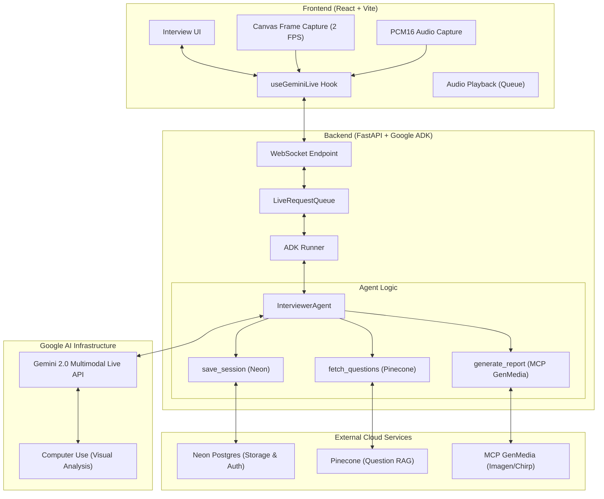

# roundZero — Multimodal AI Interview Coach (Gemini Live Edition)

> The next-gen AI interviewer that sees your code, hears your confidence, and generates personalized media reports. Built with **Gemini 2.0 Multimodal Live API** and **Google ADK**.

---

## 1. Vision & Strategy

**roundZero** has been evolved for the **Gemini Live Agent Challenge**. We've moved from a legacy asynchronous pipeline to a **Native Bidirectional Streaming Architecture**.

### Key Capabilities

- **Real-Time Vision (Computer Use)**: The agent monitors your screen (via frame capture) to provide live feedback on your coding environment and technical solutions.
- **Bidi-Streaming Audio**: Low-latency PCM16 16kHz audio for natural, human-like conversation.
- **MCP GenMedia Reports**: Post-interview "Hall of Fame" reports including:
  - **Imagen 3**: Custom success certificates.
  - **Chirp 3 HD**: High-fidelity audio performance summaries.
  - **Lyria**: Ambient background scores for the review dashboard.

---

## 2. System Architecture



---

## 3. Tech Stack

| Component       | Technology                             |
| :-------------- | :------------------------------------- |
| **LLM Engine**  | Gemini 2.0 Flash (Multimodal Live API) |
| **Framework**   | Google ADK (Agent Development Kit)     |
| **Backend**     | FastAPI (Python 3.12+)                 |
| **Frontend**    | React 19 + TypeScript + Tailwind CSS   |
| **Database**    | Neon (Postgres + Native Auth)          |
| **Vector DB**   | Pinecone (Serverless)                  |
| **Media Tools** | MCP GenMedia (Imagen, Chirp, Veo)      |

---

## 4. Getting Started

### Prerequisites

- Python 3.12+ (managed by `uv`)
- Node.js 20+
- Google Cloud Project with Gemini Multimodal Live API enabled.

### Backend Setup

```bash
cd backend
uv sync
cp .env.example .env # Add GOOGLE_API_KEY
uv run python -m app.main
```

### Frontend Setup

```bash
cd frontend
npm install
npm run dev
```

---

## 5. Development Roadmap

- [x] **Phase 1**: ADK Core Migration (Bidi-streaming audio).
- [ ] **Phase 2**: Multimodal Vision (Canvas frame capture + Computer Use instructions).
- [ ] **Phase 3**: MCP GenMedia Integration (Personalized report synthesis).
- [ ] **Phase 4**: Production Hardening (Cloud Run deployment).

---

## 6. Legacy Assets

_The following diagrams represent the original design research which still informs our product strategy:_

- [Architecture_Design.png](file:///Users/rahulpandey187/Documents/future-products/Hackathons/Vision-Agents/roundZero/Architecture_Design.png)
- [System_Design.png](file:///Users/rahulpandey187/Documents/future-products/Hackathons/Vision-Agents/roundZero/System_Design.png)
- [Market-Validated-Architecture](file:///Users/rahulpandey187/Documents/future-products/Hackathons/Vision-Agents/roundZero/Market-validated-Diagram.png)

---

## 👁️ Features

- 🎙️ **Natural Converstation**: Interruption-aware, low-latency voice interaction.
- 🧘 **Presence Awareness**: Tracks state and emotion via multimodal context.
- 🎭 **Interviewer Personas**: Toggle between 'Buddy' (supportive) and 'Strict' (high pressure).
- 📈 **Dynamic Questions**: Questions are retrieved semantically based on your selected role and past performance.
- 📊 **Insightful Reports**: Instant feedback with per-question scoring and overall performance metrics.

---

## 📄 License

MIT — Built with 💚 for the Google Hackathon.
