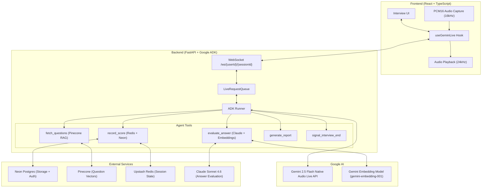
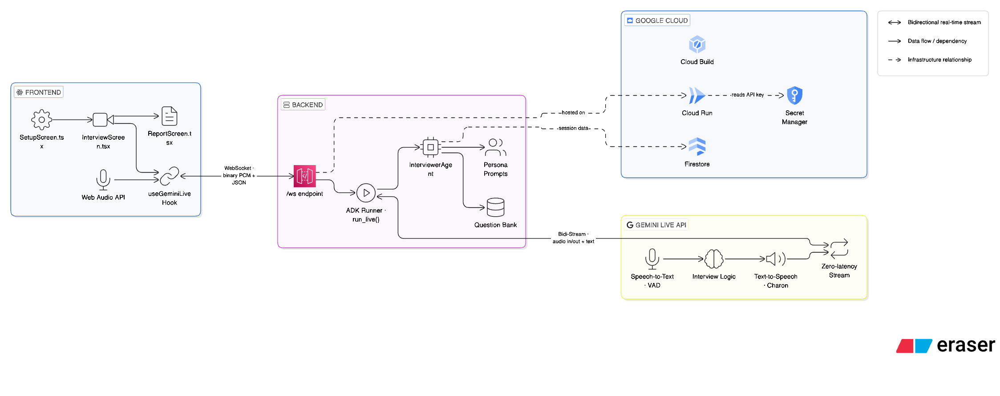

# roundZero — Multimodal AI Interview Coach

> Real-time AI interview coach using **Gemini 2.5 Flash Native Audio Live API** for bidirectional streaming audio. Aria, the AI interviewer, evaluates responses in real-time using Claude Sonnet 4.6 and Gemini Embeddings, then generates personalized performance reports. Built for the **Gemini Live Agent Challenge**.

---

## System Architecture





---

## Tech Stack

| Component        | Technology                                        |
| :--------------- | :------------------------------------------------ |
| **LLM Engine**   | Gemini 2.5 Flash (Native Audio Live API)          |
| **Answer Eval**  | Claude Sonnet 4.6 (Anthropic)                     |
| **Agent SDK**    | Google ADK (Agent Development Kit)                |
| **Embeddings**   | Gemini Embedding (`gemini-embedding-001`, 768-dim)|
| **Backend**      | FastAPI (Python 3.12+) + `uv`                     |
| **Frontend**     | React 19 + TypeScript + Tailwind CSS              |
| **Database**     | Neon (Postgres + Native Auth)                     |
| **Vector DB**    | Pinecone (Serverless)                             |
| **Cache/State**  | Upstash Redis                                     |
| **Deploy**       | Google Cloud Run (backend) + Vercel (frontend)    |

---

## Getting Started

### Prerequisites

- Python 3.12+ (managed by `uv` — install at [https://docs.astral.sh/uv/](https://docs.astral.sh/uv/))
- Node.js 20+
- Google Cloud Project with Gemini API enabled

### 1. Backend Setup

```bash
cd backend
uv sync
cp .env.example .env   # fill in credentials (see Environment Variables below)
uv run python run.py   # starts on http://localhost:8080
```

> **Important:** Always use `uv run python run.py`, not `python -m app.main`. The `run.py` script sets `ws="wsproto"` in Uvicorn — without this, WebSocket connections return 400 errors.

### 2. Frontend Setup

```bash
cd frontend
npm install
cp .env.example .env   # set VITE_BACKEND_URL=http://localhost:8080
npm start              # dev server on http://localhost:3000
```

---

## Environment Variables

### Backend (`backend/.env`)

```env
# Required
GOOGLE_API_KEY=your_google_ai_studio_key
GEMINI_MODEL=gemini-2.5-flash-native-audio-latest
ANTHROPIC_API_KEY=your_anthropic_key
DATABASE_URL=postgresql://...  # Neon connection string
JWT_SECRET=your_jwt_secret

# Pinecone
PINECONE_API_KEY=your_pinecone_key
PINECONE_INDEX=your_index_name

# Upstash Redis
UPSTASH_REDIS_REST_URL=https://...
UPSTASH_REDIS_REST_TOKEN=your_token

# Neon Auth
NEON_AUTH_JWKS_URL=https://...
NEON_AUTH_ISSUER=https://...
NEON_AUTH_AUDIENCE=your_audience
```

See `backend/.env.example` for the full list with descriptions.

### Frontend (`frontend/.env`)

```env
VITE_BACKEND_URL=http://localhost:8080
REACT_APP_NEON_AUTH_URL=https://...
```

---

## Testing

```bash
cd backend

# Run all tests
uv run pytest -v

# Run specific test files
uv run pytest tests/test_question_engine.py -v
uv run pytest tests/test_report_generator.py -v

# Run a single test by name
uv run pytest tests/test_question_engine.py::test_name -v

# Lint
uv run ruff check .
uv run ruff format .
```

---

## Deployment

### Backend (Google Cloud Run)

```bash
cd backend
gcloud builds submit --config cloudbuild.yaml --project=YOUR_PROJECT_ID
```

The `cloudbuild.yaml` pipeline:
1. Builds a Docker image and pushes to Google Container Registry
2. Deploys to Cloud Run with session affinity, 1 min instance, and secrets from Cloud Secret Manager

### Frontend (Vercel)

Vercel auto-deploys from the `main` branch. Set `VITE_BACKEND_URL` in your Vercel environment to the Cloud Run service URL.

---

## Key Capabilities

- **Bidirectional Audio**: Low-latency PCM16 streaming — 16kHz capture, 24kHz playback
- **Intelligent Evaluation**: 70/30 blend of Claude semantic scoring and Gemini embedding similarity
- **Semantic Question Retrieval**: Role-specific questions fetched from Pinecone based on session context
- **Adaptive Follow-ups**: Aria asks follow-up questions or gives hints before closing each question
- **Performance Reports**: Per-question scoring with overall metrics, generated at session end
- **Interviewer Personas**: Buddy (supportive) vs Strict (high pressure) modes

---

## Features

- Natural interruption-aware voice conversation
- JWT-authenticated WebSocket sessions
- Questions stored in Redis per session, scores persisted to Neon Postgres
- Separate audio contexts — mic capture and AI playback never share an AudioContext
- Screen-share detection and AI generation detection

---

## License

MIT — Built for the Google Gemini Live Agent Challenge.
